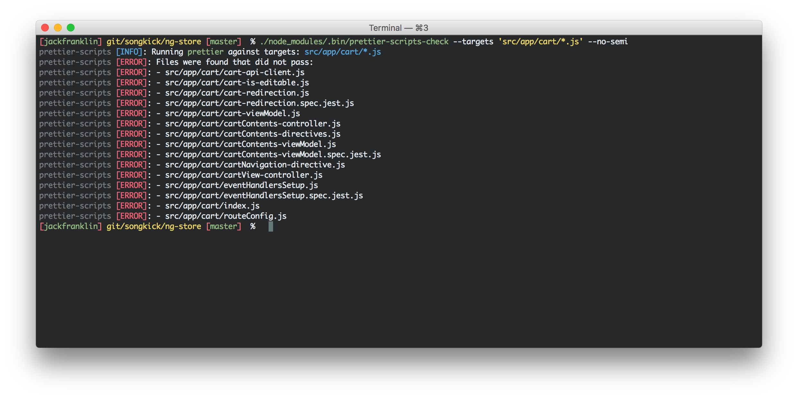

# prettier-scripts


```
$ yarn add --dev prettier-scripts
```

prettier-scripts is a collection of command line executables that makes adopting Prettier into your code base a little bit easier to run Prettier against your project's files. It also makes it easy to run Prettier just on files that have changed, meaning you can easily get pre-commit hooks sorted and make your team's lives much easier as they adjust to Prettier.



## Installation

```
$ yarn add --dev prettier-scripts
```
Or if you prefer npm:

```
$ npm install --dev prettier-scripts
```

__IMPORTANT__: prettier-scripts _does not_ install `prettier` or `prettier-eslint` for you. Your project must have those installed already.

## Scripts

prettier-scripts provides two executables currently, one to check your code base and one to format files:

```
$ ./node_modules/.bin/prettier-scripts-check ...
```

and

```
$ ./node_modules/.bin/prettier-scripts-write ...
```

Both scripts take the same set of arguments. Any argument that [Prettier's CLI accepts](https://github.com/prettier/prettier#options) will be passed to Prettier accordingly.

`prettier-scripts-check` will exit with the correct exit code based on if Prettier succeeded or failed, so it's perfect to run as a pre-commit hook or on your CI server.

There is one exception to the Prettier CLI; rather than pass a glob of files as a standalone option, you have to pass them through the `--targets` argument. This is because there are two ways to give prettier-scripts some files; either by telling it to use `git` to calculate the changed files, or by passing a glob to `--targets`.

For example:

- Run `prettier` on only changed files and write them: `prettier-scripts-write --changed`
- Run `prettier` on all targets and write them: `prettier-scripts-write --targets 'src/**/*.js'`

If you only wanted to check the files, you can swap `prettier-scripts-write` for `prettier-scripts-check`.


There are also some additional flags that prettier-scripts uses:

- `--prettier-eslint`: Uses [prettier-eslint-cli](https://github.com/prettier/prettier-eslint-cli), rather than Prettier directly.
- `--filter-changed`: When you are using `--changed`, you can also pass `--filter-changed` to filter which changed files are passed through. For example, you would pass `--filter-changed '**/*.js'` to filter the changed files to just JavaScript.

### Log Level

By default the level of logging is set to `warn`. You can change how much or little is logged by prettier-scripts via `LOG_LEVEL`:

```
$ LOG_LEVEL=debug prettier-scripts-check --changed
```

You can set the log level to:

- trace
- debug
- info
- warn (default)
- error

## Examples

#### Check only changed files, and use no semi colons:

```
$ ./node_modules/.bin/prettier-scripts-check --changed --no-semi
```

#### Check only changed JavaScript files:

```
$ ./node_modules/.bin/prettier-scripts-check --changed --filter-changed '**/*.js'
```

#### Check all targets, and use no semi colons:

```
$ ./node_modules/.bin/prettier-scripts-check --no-semi --targets 'src/**/*.js'
```

#### Set `print-width` to `120` and write all files:

```
$ ./node_modules/.bin/prettier-scripts-write --print-width 120 --targets 'src/**/*.js'
```

#### Check your entire project in an npm script for use on CI

```
// package.json
{
  "scripts": {
    "prettier-check-all": "prettier-scripts-check --targets 'src/**/*.js' --no-semi --trailing-comma es5"
  }
}
```
